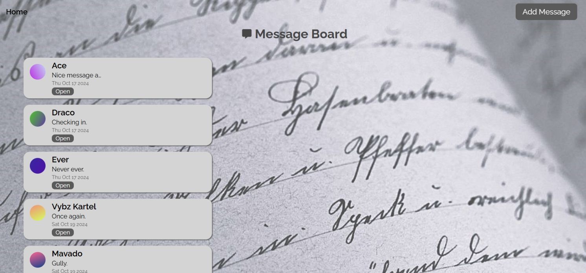

<div align='center'>

# Message board App

</div>
<div align='center'>
    <h3>💻 Technologies</h3>
    
    
    
    
    
    
    
    


    <!-- <h4><a href="https://asdacosta.github.io/###/">Live Preview</a></h4> -->
</div>

<!-- **Demo:** -->

<!--  -->

<details>

**<summary>Screen views</summary>**

**Desktop View:**


<br>

**Tablet View:**


<br>

**Mobile View:**


</details>

## 🌐 Origin

[The Odin Project](https://www.theodinproject.com/)

## 📝 Description

A message app that enables users to input name and message.

<details>
<summary>Features</summary>

- ### Insert and view message.

</details>

## 🎯 Relevance

To solidify concepts of `Routes, Controllers, Views` in Express, and PostgreSQL.

## 👥 Intended Audience

Developers, users, and non-developers.

> [!NOTE]
> Users can install all dependencies using `package.json` file via:
>
> ```bash
> npm install
> ```

## 📂 Files

<details>
<summary>Invert</summary>

| File              | Description                                               |
| ----------------- | --------------------------------------------------------- |
| `controllers/*`   | Functions that handle routes.                             |
| `src/index.js`    | The main JavaScript entry point that bundling begins.     |
| `db/*`            | Database files.                                           |
| `view/*`          | EJS files.                                                |
| `Procfile`        | Config for Koyeb.                                         |
| `app.js`          | Index app.                                                |
| `package*`        | Contains details of project and dependencies versions.    |
| `readme-assets/*` | Live demo and different screen views used in `README.md`. |

</details>

## ©️ Credit

<details>
<summary>Invert</summary>

| File | Description |
| ---- | ----------- |

</details>

## 🔄 Improvements

<details>
<summary>Invert</summary>

- [ ] Enable editing
- [ ] Add profile pic

</details>

## 👤 Curator

1. [Name](https://github.com/asdacosta)

**[🞁 Top](#message-board-app)**
